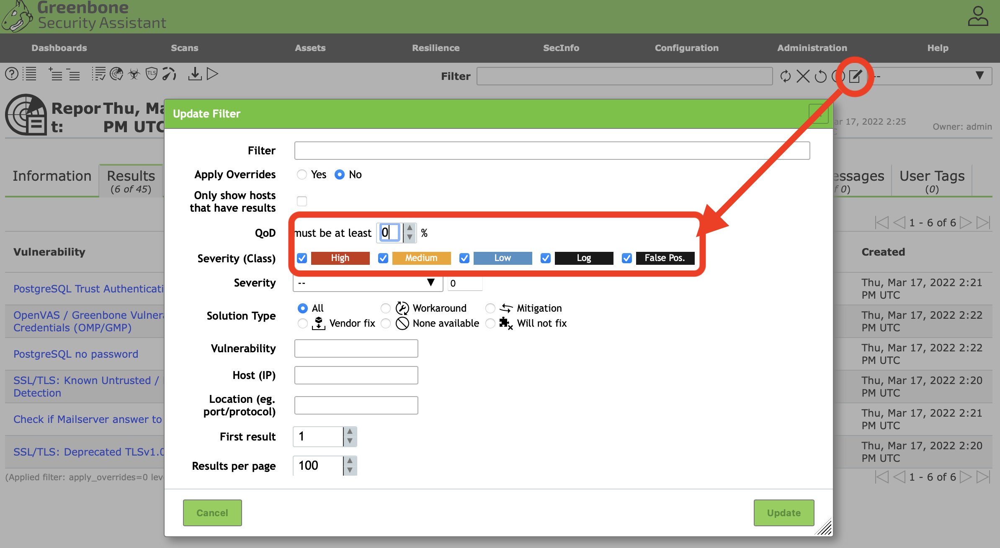

> **UPDATE: Greenbone provides the Community Edition as container based solution**
>
> See https://greenbone.github.io/docs/latest/21.04/container/ for more information

# Greenbone Docker Quickstart

> The following information may contain outdated container images! See https://greenbone.github.io/docs/latest/21.04/container/ for the official container images

This document gives a quick overview how to setup and run _Greenbone Community Edition_ in a Docker container.

Further documentation for the Docker-image used in this guide can be found [here](https://securecompliance.gitbook.io/projects/).

If you don't have access to a Docker host, an alternative way of spinning up a test-instance is using the [Trial-Version](https://www.greenbone.net/en/testnow/) which is based on VMware/VirtualBox.

### Known Limitations:

- Running Greenbone in Docker is not officially supported and not all checks work as intended (e.g. back-channels to Greenbone on dynamic ports)
- Using the community feed may result in not daily updated feed-data
- When using the community feed you should not perform more than one concurrent feed-update. Otherwise the feed-server will block your ip for a certain amount of time

### Security considerations

The container uses

- a self-signed certificate (browser warning)
- insecure default credentials (user: `admin`, password: `adminpassword`)

It is meant for local testing purposes only.

> **Do not use it in a production environment!**

## Prerequisites

- Docker & Docker Compose
  - Linux, e.g. Debian: https://docs.docker.com/engine/install/debian/ (link contains information for other distros and `compose` too)
  - Mac/Windows: https://www.docker.com/products/docker-desktop
- Machine with at _least_ 4GB RAM

## Docker-Compose file

In a local directory (e.g. `gvm-compose`) create a file `docker-compose.yml` with the contents:

```yaml
version: "3"
services:
  gvm:
    image: securecompliance/gvm:debian-master-data-full
    volumes:
      - ./data/db:/opt/database
      - ./data/gvm:/var/lib/gvm
      - ./data/plugins:/var/lib/openvas/plugins
    ports:
      - "9392:9392" # webui via https://localhost:9392
```

> All `docker-compose` commands must be run in this folder.

## Start container and monitor plugin update

Run the following commands in your working directory.

> Note: Upgrading the feed can take some time.

> Important: Ensure you don't pull the community parallel on multiple machines with the same public ip. Rules on the community feed server will block your ip as parallel downloads are **forbidden**!

```bash
docker-compose up -d
docker-compose logs -f --tail=20
```

## Accessing the Web UI

Point your browser to `https://localhost:<your_port_in_compose_file>` (using HTTPS!)

> Note: After initially starting or restarting the container it may take some time until the Web UI is available again. Check your container logs for the current plugin update status.

The default credentials for the Web UI are `admin:adminpassword`

Before starting a scan, you should check in the menu _Administration_/_Feed Status_ that all feeds are up-to-date and **no** update is _in progress_.

> Note: Depending on the feed you use (especially community feed) the data available can be some days old

If the status report _in progress_ you have to wait for it to finish. Do not start a scan until the feed is completly updated as this may impact your results!

## Filtering Results

By default Greenbone filters results that

- have a quality of detection < 70% (QoD)
- have a level of _log_ or _false positive_

To get a view of all results the default filter for vulnerabilities has to be adjusted.



## Exporting Results

We recommend exporting the results of your scans to (using all three as **AND**)

- `csv`
- `xml`
- `pdf`

format for future reference.

Do this before removing the Docker container, or you will lose the results!

> The export function uses the global filter for vulnerabilites as described in the previous section.

For sharing the results, please use the following name-convention:

```text
<vendor>_<device>_<yyyymmdd>.[csv|pdf|xml]
```


## FAQ

### When is the feed update finished?

If your container's log shows

```bash
gvm-compose-gvm-1  | -----------------------------------------------------------
gvm-compose-gvm-1  | +        Find logs at: /var/log/supervisor/               +
gvm-compose-gvm-1  | +              and at: /var/log/gvm/                      +
gvm-compose-gvm-1  | ===========================================================
gvm-compose-gvm-1  | 2022-03-14 11:56:50,625 INFO exited: init (exit status 0; expected)
```

you can expect the feed update to have finished and the web UI to be active.

In the Web UI check the menu _Administration_/_Feed Status_ - there must not be an active process! Wait until this is finished (may take some time).

### Plugin feed reports _too old_

> IMPORTANT: It is important, that the **NVT-Feed** is up-to-date.
>
> The **GVM-Data**-Feed may be out of date, as we are relying on the community version.

You can issue a manual feed update **in** the container itself:

```bash
# gvm-container-shell
/opt/setup/scripts/sync-all.sh
```

If the **NVT-Feed** still reports _too old_ after manually running the update, it is advisable to delete the local folders used by the container to enforce a reinstall using the current data files packaged with the image.

```bash
cd <working directory>
rm -r ./data
```

> Ensure to backup all results and policies you need for further testing!

### How can i pull the latest image of the container?

To pull the latest avaiable image, run the command

```bash
docker-compose down
docker-compose pull
docker-compose up -d
```
